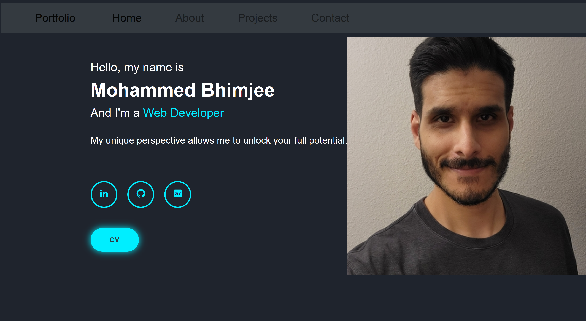

# Portfolio Built With React

## Description

A simple portfolio created with React

## Table of Contents

- [Installation](#installation)
- [Usage](#usage)
- [Contributing](#contributing)
- [Tests](#tests)
- [License](#license)
- [Questions](#questions)
- [Credits](#credits)
- [Preview](#preview)

## Installation

N/A

## Usage

View my portfolio [here](https://chartok.github.io/my_portfolio/).

## Contributing

Contact me on GitHub

## Tests

Clone repository>open directory in terminal>install dependencies>run 'npm test'

## License

MIT License
<https://opensource.org/licenses/MIT>

## Questions

If you have any questions, please contact me at <m.bhimjee@outlook.com>.
You can also find me on GitHub at Chartok.

## Credits

Mohammed "Asad" Bhimjee

## Preview

